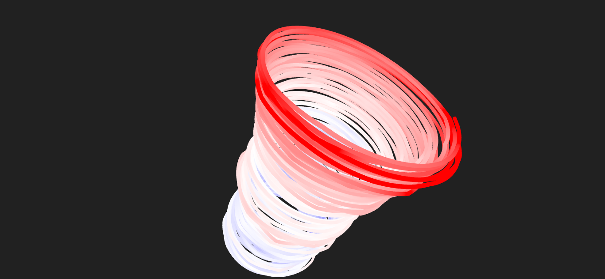

# climate-helix
This HTML-5 application features a 3D climate helix similar to the one shown in [Coding Train, How to Code a Climate Spiral](https://youtu.be/rVBTxnRyOuE?t=2384).

Available on [Github Pages](https://mkuehne-git.github.io/climate-helix/). The application can be installed as PWA (tested on Android).

The climate helix uses data from [NASA, Goddard Space Flight Center](https://data.giss.nasa.gov/gistemp/) retrieved in May-2023. You can view data for the

* Northern Hemissphere,
* Southern Hemissphere,
* Globe

The time ranges from 1880 until March 2023. Each year is visualized as a loop within the helix. Each loop is divided into 12 segments, one for each month of the year. The distance from the center per month is proportional to the difference to the mean temperature of that month. For details regarding the data and the theory behind it, please check out the [GISS](https://data.giss.nasa.gov/gistemp/) documentation.

The use of [OrbitControls](https://threejs.org/docs/#examples/en/controls/OrbitControls) makes it possible to easily navigate through the scene, by moving around a virtual camera. That means, you can scale, translate or rotate the image.

The controller UI (Icon in the upper right corner) provides options to configure the image. Not only can you choose, which region of the world you want to be visualized. With the ***View*** menu item you can change the coloring and some parameters controlling the geometry. With the ***Capture*** menu you can create images and download them to your computer.


# Keyboard

|Key|Description|
|---|---|
|```h```, ```H```|Toggle visibility of control panel|
|```CTRL + #```|Take screen capture|
|```Esc```|Close imprint dialog|

# References

* [Coding Train, How to Code a Climate Spiral](https://youtu.be/rVBTxnRyOuE)
* [NASA, Goddard Space Flight Center](https://data.giss.nasa.gov/gistemp/)
* [OrbitControls - three.js docs](https://threejs.org/docs/#examples/en/controls/OrbitControls)

# Acknowledgments

* [Vite](https://github.com/vitejs/vite) - Next Generation Frontend Tooling
* WebGL [three.js](https://threejs.org/)
* Settings with [lil-gui](https://github.com/georgealways/lil-gui)
* [vite-plugin-pwa](https://vite-pwa-org.netlify.app/) - PWA Vite Plugin, used to transform the application into PWA, see `vite.config.ts`.
* [FavIcon Generator](https://realfavicongenerator.net/) - I used this to generate the `favicons` and the related section in `index.html`. PWA icons were generated with `PWABuilder Studio` inside VS Code.
# License

This project is licensed under the MIT License - see the [LICENSE](https://github.com/mkuehne-git/climate-helix/blob/main/LICENSE) file for details

