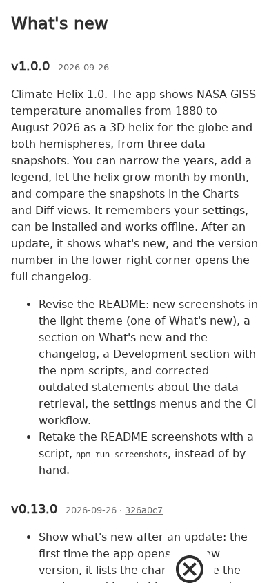
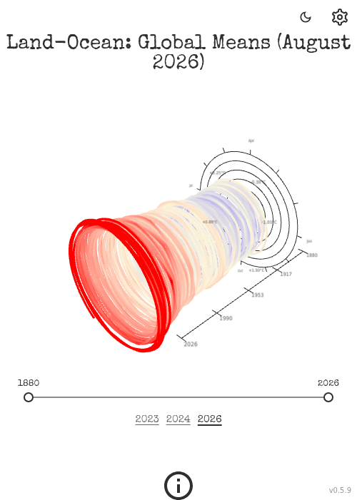
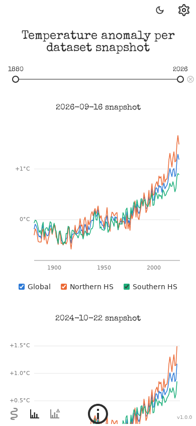
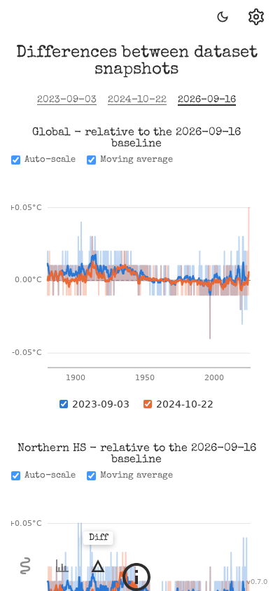

# climate-helix
This HTML-5 application features a 3D climate helix similar to the one shown in [Coding Train, How to Code a Climate Spiral](https://youtu.be/rVBTxnRyOuE?t=2384).

Available on [Github Pages](https://mkuehne-git.github.io/climate-helix/). The application can be installed as PWA (tested on Android).

The climate helix uses data from [NASA, Goddard Space Flight Center](https://data.giss.nasa.gov/gistemp/), in three retrievals (see [Dataset selector](#dataset-selector)). You can view data for the

* Northern Hemisphere,
* Southern Hemisphere,
* Globe

The data starts in 1880 and, in the newest bundled snapshot, runs until August 2026. Each year is visualized as a loop within the helix. Each loop is divided into 12 segments, one for each month of the year. The distance from the center per month is proportional to the difference to the mean temperature of that month. For details regarding the data and the theory behind it, please check out the [GISS](https://data.giss.nasa.gov/gistemp/) documentation.

The use of [TrackballControls](https://threejs.org/docs/#examples/en/controls/TrackballControls) makes it possible to easily navigate through the scene, by moving around a virtual camera: drag with the left mouse button (or one finger) to rotate the helix freely in any direction, including end over end, zoom with the mouse wheel (or a pinch), and pan with the right mouse button (or two fingers). A double-click returns to the initial view. The ***View > Navigation*** section of the settings panel sets the **Rotation speed** and **Inertia**: with inertia, the helix keeps turning for a moment after a drag; without it, it stops with the pointer.

The controller UI (Icon in the upper right corner) provides options to configure the image. Not only can you choose, which region of the world you want to be visualized. With the ***View*** menu item you can show the year range slider and the legend axes, change the colors, and adjust the geometry and navigation; the ***Animation*** menu sets up the creation animation. With the ***Screen capture*** menu you can create images and download them to your computer.

# Dataset selector

Climate Helix bundles multiple retrievals of the NASA GISS data, currently with data up to March 2023, September 2024 and August 2026 (retrieved in September 2023, October 2024 and September 2026). Buttons below the helix, labeled with the snapshot's year, let you jump directly between these snapshots, and the same choice is available as a **Date** section in the settings panel. Switching datasets keeps your selected region and year range, clamping it to whatever years are available in the newly selected snapshot.

# Year range slider

A dual-handle slider below the helix lets you narrow the displayed years to any range within the selected dataset. Dragging either handle updates the start or end year and redraws the helix immediately. The slider itself can be shown or hidden with the **Year range** toggle under the ***View*** menu. The Charts and Diff views have the same slider, and all three share the chosen range: switching views keeps it, limited to the years the view can show. The small X button to the right of a slider resets it to all years.

# Animation

The Play/Pause button in the top-left corner of the Helix view grows the helix month by month from the first selected year, while the year and month it has reached are shown below the title. Pause holds it; Play continues. Changing the year range, dataset, region or another setting stops the animation and shows the complete helix. The ***Animation*** section of the settings panel sets the **Duration** (in seconds for all years of the dataset; a shorter year range plays proportionally shorter), **Loop**, and **Play on start**, which plays it once when the app opens.

# Remembered settings

The app remembers your settings and where you left off: the dataset, region and year range, the ***View*** and ***Animation*** settings, changed helix colors, the theme (once you switch it; until then it follows your system), the active view, the camera angle and zoom, the Diff view's baseline, and the chart checkboxes. They are kept in your browser's Local Storage and never leave your device. When a newer data snapshot ships, the app opens on it instead of the snapshot you last chose. **Restore defaults** in the settings panel forgets all of this and reloads the app.

# What's new and changelog



The first time the app opens after an update, it shows what's new since the version you used last. Versions without a visible change (tests, documentation) are left out, and the **Full changelog** button shows every version. It appears once per version: not again after a reload, not after **Restore defaults**, and not on your very first visit.

Click the version number in the lower right corner to see the full changelog at any time. Each version lists its date and links to its commit on GitHub. Close it, like the imprint, with the X button at the bottom or with Escape. The changelog is the same as [CHANGELOG.md](CHANGELOG.md).

# Legend



The ***View > Legend*** section in the settings panel (shown open above) adds optional reference axes around the helix: a **Year axis** marking the year range along the side, a **Temperature axis** of concentric rings labeling anomaly values from -1.0°C to +1.5°C, and a **Month axis** labeling Jan/Apr/Jul/Oct around the outer rim. The number of year ticks and temperature rings shown is configurable.

# Charts

Three icon-buttons at the lower-left switch between equal peer scenes: **Helix** (the 3D view described above), **Charts**, and **Diff**. The info button and settings panel stay available in every scene; the info panel's content follows whichever scene is active.

* **Charts** renders one time-series chart per dataset snapshot, all three regions (Global, Northern HS, Southern HS) overlaid on a shared year axis. The same year range slider as in the Helix view zooms the x-axis of all charts.

  

* **Diff** lets you pick a baseline snapshot (shown by year, like the Helix dataset selector), then shows one chart per region with a line for every other snapshot's monthly difference from that baseline - revealing that NASA revises historical data between snapshots, not just appends new months. The y-axis always rescales to the lines that are checked and the years in view, and each chart has a **Moving average** toggle (overlays a smoothed 12-month trend and dims the raw line). The same year range slider as in the Helix view zooms the x-axis of all charts.

  

* Every chart has a legend with a checkbox per series to show or hide it, and a hover crosshair with a tooltip showing exact values.

# Keyboard

|Key|Description|
|---|---|
|```h```, ```H```|Toggle visibility of control panel|
|```Alt + s```|Take screen capture|
|```Esc```|Close the imprint, the changelog or What's new|
|```a``` + drag|Rotate the helix (like the left mouse button)|
|```s``` + drag|Zoom (like the mouse wheel)|
|```d``` + drag|Pan (like the right mouse button)|
|Double-click|Return to the initial view|

# PWA version updates

The app is shipped as a PWA and checks for newer versions after installation. When a new build is detected, the app asks for confirmation before reloading and applying the update. After the reload, it shows what's new in the updated version. This is handled through the service worker lifecycle and avoids unexpected restarts during normal use.

If you installed the app from a supported browser such as Chrome on Android, the settings menu also includes a manual **Check for updates** action. This triggers a service worker refresh check and shows a short status message when the app is already up to date or when a new version is available.

# Dependency management

Dependency updates are handled through GitHub Dependabot for npm packages. The repository is configured to check for weekly updates, keep runtime and build-tooling packages grouped, and keep the update noise focused on the packages that matter most for the app.

Every push to `main` and every pull request, including Dependabot's, runs the CI workflow in GitHub Actions: it installs the dependencies with `npm ci`, runs the unit tests and a production build on Node 24. It does not deploy. Dependabot also keeps the workflow's GitHub Actions up to date.

The automation is configured in [.github/dependabot.yml](.github/dependabot.yml) and [.github/workflows/ci.yml](.github/workflows/ci.yml).

Major framework upgrades are still reviewed manually, especially for Vite, Three.js and the PWA plugin, because those are the most likely to affect app behavior or service-worker behavior.

# Development

Climate Helix is built with Vite and TypeScript and needs Node.js 24 (see `.nvmrc`).

```sh
npm install         # install dependencies
npm run dev         # development server (HTTPS with a self-signed certificate)
npm run dev:http    # the same over HTTP, if the browser rejects the certificate
npm run build       # production build in dist/
npm test            # unit and component tests (Vitest)
npm run test:e2e    # end-to-end tests in Chromium and Firefox (Playwright)
npm run screenshots # retake the screenshots in this README (light theme)
```

The tests are described in [TESTING.md](TESTING.md), the changes of each version in [CHANGELOG.md](CHANGELOG.md).

# References

* [Coding Train, How to Code a Climate Spiral](https://youtu.be/rVBTxnRyOuE)
* [NASA, Goddard Space Flight Center](https://data.giss.nasa.gov/gistemp/)
* [TrackballControls - three.js docs](https://threejs.org/docs/#examples/en/controls/TrackballControls)

# Acknowledgments

* [Vite](https://github.com/vitejs/vite) - Next Generation Frontend Tooling
* WebGL [three.js](https://threejs.org/)
* Settings with [lil-gui](https://github.com/georgealways/lil-gui)
* [vite-plugin-pwa](https://vite-pwa-org.netlify.app/) - PWA Vite Plugin, used to transform the application into PWA, see `vite.config.ts`.
* [FavIcon Generator](https://realfavicongenerator.net/) - I used this to generate the `favicons` and the related section in `index.html`. PWA icons were generated with `PWABuilder Studio` inside VS Code.
# License

This project is licensed under the MIT License - see the [LICENSE](https://github.com/mkuehne-git/climate-helix/blob/main/LICENSE) file for details

